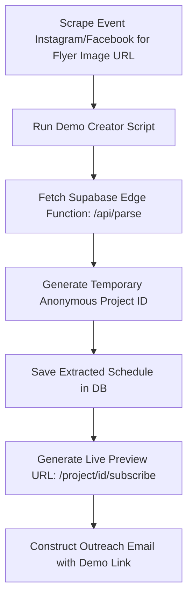

# Pillar 2: Organizer Outreach Sequence & Growth Assets

This document defines the outreach campaigns, B2B landing page hero copy, and virality automation pipelines designed to scale acquisition of event organizers in Europe for FlyerToCalendar.

---

## Part 1: Cold Outreach Sequences (Europe Festivals)

### Email Variant 1: The "Support Reduction" Angle (For Large-scale Bachata/Salsa Congresses)
* **Subject**: Quick Q: How many times did attendees ask for the PDF schedule at [Festival Name]?
* **Pre-header**: Eliminate 80% of schedule-related support DMs with a live calendar sync link.

"Hi [Organizer Name],

Congrats on wrapping up [Last Edition/Year] of [Festival Name]—the lineup looked incredible!

I noticed that like most dance congresses, your schedule was distributed as a graphic flyer on Instagram and a PDF on your website. 

While beautiful, flyers pose a hidden cost: **your inbox gets flooded with "What room is Room B?" or "Did the workshop time change?"** when last-minute adjustments happen.

We built **FlyerToCalendar** to solve this. In 1 click, our AI converts your graphic flyer into a live-syncing calendar feed (Google/Apple Calendar) for your attendees. 

If you update a time slot on your dashboard, it auto-updates on their phones instantly. 

Would you be open to a 2-minute live demo where I convert your [Upcoming Edition] flyer into a working calendar link?

Best regards,
[My Name]
Co-Founder, FlyerToCalendar
[Link to flyertocalendar.vercel.app]

---

### Email Variant 2: The "Last-Minute Schedule Change" Angle (For Techno/Electronic Music Festivals)
* **Subject**: Handling last-minute set time changes at [Festival Name]
* **Pre-header**: Don't let schedule adjustments ruin attendee experience.

"Hi [Organizer Name],

With [Festival Name] coming up, you're probably finalizing set times and stage assignments. 

But as you know, last-minute DJ cancellations or room swaps are inevitable. When that happens, reposting an edited graphic on Instagram stories means 50% of your attendees still show up to the wrong stage because they missed the post.

**FlyerToCalendar** lets you upload your line-up graphic, generates a branded QR code for your check-in wristbands/flyers, and subscribes attendees to a live-syncing feed. 

If a set time changes:
1. You edit it on your dashboard.
2. It pushes the update to their native phone calendar (Apple/Google) instantly.

No apps to download. No lost attendees.

I’ve created a quick preview schedule of your day 1 lineup here: [Insert Live Demo Link]. 

Would love to hear if this would save your team support hours this year.

Cheers,
[My Name]
FlyerToCalendar
[Link to flyertocalendar.vercel.app]

---

### Email Variant 3: The "Sponsor Visibility" Angle (For Multi-Genre European Festivals)
* **Subject**: Boost sponsor impressions on [Festival Name] attendee calendars
* **Pre-header**: Put your sponsor names directly inside the native calendar events.

"Hi [Organizer Name],

As you plan the attendee experience for [Festival Name] this summer, you're likely looking for high-impact sponsor placements.

Instead of just putting sponsor logos on physical banners, what if you could put them directly in your attendees' native phone calendars?

**FlyerToCalendar** converts your festival flyer into a live-syncing feed. Inside each event description (e.g., '14:00 Workshop with [Artist]'), you can add sponsor links and promo codes. Since attendees check their calendars repeatedly during the festival, you gain a 90%+ engagement rate for your partners.

Here is how it works:
- Step 1: Upload your flyer.
- Step 2: Attendees scan the QR code to subscribe.
- Step 3: Sponsors get direct links on every calendar event description.

Are you free for a brief call next Tuesday to see a 2-minute walkthrough?

Best,
[My Name]
FlyerToCalendar
[Link to flyertocalendar.vercel.app]

---

### Instagram DM Scripts (For Outreach to Dance Event Handles)

#### Hook Option A (Direct Value):
"Hey [Festival Name] team! Love your content. Quick question: do you get a lot of DMs from dancers asking where to find the workshop room assignments? We built a tool that turns your schedule flyer into an auto-updating phone calendar link in 1 click. Can we send you a quick mock-up of your schedule?"

#### Hook Option B (Interactive/Playful):
"Hey guys! 💃 We’re building a calendar sync for European dance festivals. We converted your flyer schedule for [Festival Name] into a live-syncing Google/Apple calendar link to show you how it works. Mind if we drop the link here?"

---

## Part 2: B2B Landing Page Hero Section

```markdown
# Reduce Support Overhead by 80%

## Turn your festival flyer into an auto-updating calendar feed for attendees in 1 click.

FlyerToCalendar parses your workshop schedules, set times, and artist rosters directly from graphic flyers. Attendees scan one branded QR card to subscribe—automatically syncing schedules to their native iOS, Android, or Google Calendar. 

When lineup details change last minute, update them on your dashboard, and they refresh on your attendees' phones instantly. No app downloads required.

[🚀 Convert Your First Flyer Free]  [📅 Book a 10-Min Demo]

*No credit card required. Up to 10 flyers in Pro trial.*
```

---

## Part 3: Automated Demo Script Pipeline (Spec)

To drive virality and ease sales friction, we will implement an automated pipeline that programmatically generates personalized outbound sales pitches.

### System Flow Diagram


### Script Architecture Specification
The script `scripts/generate_sales_demo.py` will function as follows:

```python
import sys
import requests
import json

def generate_demo(flyer_image_path_or_url):
    print(f"Loading flyer: {flyer_image_path_or_url}")
    
    # 1. Trigger the parser API
    api_url = "https://flyertocalendar.vercel.app/api/projects/create-anonymous"
    
    # Extract event name from filename/context
    payload = {
        "eventName": "Festival Preview Schedule",
        "events": [
            # Dummy payload if mocking, otherwise triggers Supabase parsing edge function
            {
                "title": "Welcome Keynote & Registration",
                "artist": "Festival Team",
                "date": "2026-08-05",
                "startTime": "09:00",
                "endTime": "10:30",
                "room": "Main Room"
            },
            {
                "title": "Bachata Masterclass",
                "artist": "Marco & Sara",
                "date": "2026-08-05",
                "startTime": "11:00",
                "endTime": "12:30",
                "room": "Room A"
            }
        ]
    }
    
    # In production, we'll download the flyer image from the URL, convert it to Base64,
    # and call /api/parse directly to get the structured JSON array.
    
    headers = {"Content-Type": "application/json"}
    response = requests.post(api_url, data=json.dumps(payload), headers=headers)
    
    if response.status_code == 200:
        result = response.json()
        project_id = result.get("projectId")
        preview_url = f"https://flyertocalendar.vercel.app/project/{project_id}/subscribe"
        print(f"SUCCESS: Created interactive demo link!")
        print(f"Demo Link: {preview_url}")
        return preview_url
    else:
        print("FAILED to create demo project.")
        return None

if __name__ == "__main__":
    if len(sys.argv) < 2:
        print("Usage: python generate_sales_demo.py <flyer_image_url>")
    else:
        generate_demo(sys.argv[1])
```
